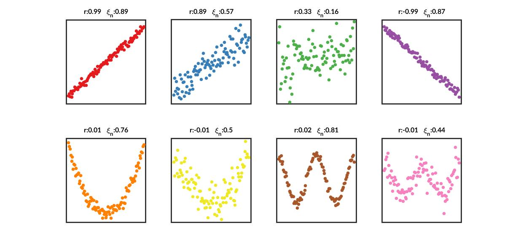

# Chaterjee's xi correlation for MATLAB
[](https://www.mathworks.com/matlabcentral/fileexchange/112530-chaterjee-s-xi-correlation)

An implementation of Chaterjee's xi correlation in MATLAB

````
x = linspace(0, 20, 1000);
y = cos(x) + 0.3*randn(1, 1000);

xi = xicor(x, y);
````

The difference between Pearson's and xi-correlation: 


References:
1. Sourav Chatterjee, A New Coefficient of Correlation, Journal of the American Statistical Association, 116:536, 2009-2022, 2021. [DOI:10.1080/01621459.2020.1758115](https://doi.org/10.1080/01621459.2020.1758115)
